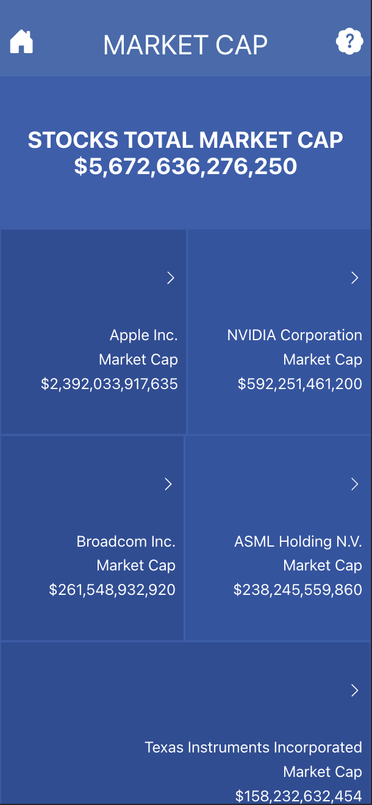
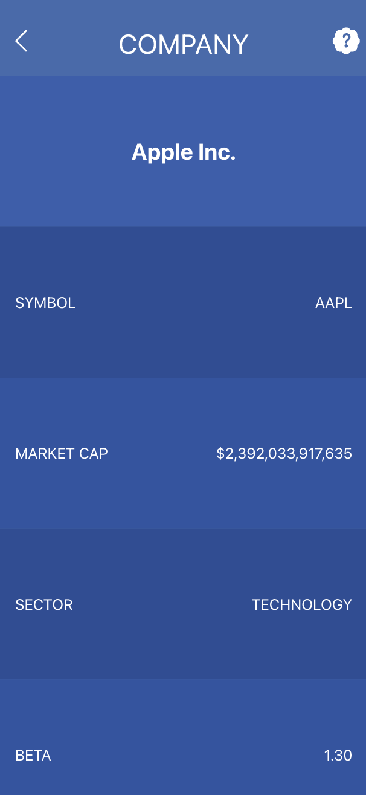

  <h1><b>STOCKS</b></h1>
  
  
   

 

<!-- TABLE OF CONTENTS -->

# 📗 Table of Contents

- [📗 Table of Contents](#-table-of-contents)
- [📖 About ](#-about-)
  - [🛠 Built With ](#-built-with-)
    - [Tech Stack ](#tech-stack-)
    - [Key Features ](#key-features-)
  - [🚀 Live Demo ](#-live-demo-)
  - [💻 Getting Started ](#-getting-started-)
    - [Prerequisites](#prerequisites)
    - [Setup](#setup)
    - [Install](#install)
    - [Usage](#usage)
  - [👥 Author ](#-author-)
  - [🔭 Future Features ](#-future-features-)
  - [🤝 Contributing ](#-contributing-)
  - [⭐️ Show your support ](#️-show-your-support-)
  - [🙏 Acknowledgments ](#-acknowledgments-)
  - [❓ FAQ (OPTIONAL) ](#-faq-optional-)
  - [📝 License ](#-license-)

<!-- PROJECT DESCRIPTION -->

# 📖 About 

**STOCKS** is a single page web application (SPA) built with React, Redux, Axios, and Jest, which:

- Shows a list of popular companies' stock tickers
- Shows detailed financial metrics for each company stock ticker

## 🛠 Built With 

### Tech Stack 

  
Client

  <ul>
    <li><a href="https://reactjs.org/">React</a></li>
  </ul>
  <ul>
    <li><a href="https://developer.mozilla.org/en-US/docs/Web/HTML">HTML</a></li>
  </ul>
  <ul>
    <li><a href="https://developer.mozilla.org/en-US/docs/Web/CSS">CSS</a></li>
  </ul>

<!-- Features -->

### Key Features 

- **Single Page Application (SPA)**

(<a href="#readme-top">back to top</a>)

<!-- LIVE DEMO -->

## 🚀 Live Demo 

- [Visit](https://stocks-1mvz.onrender.com/)
- [Watch](https://www.loom.com/share/724849078eef4ed08f227e65eb31c6fa)

(<a href="#readme-top">back to top</a>)

<!-- GETTING STARTED -->

## 💻 Getting Started 

To get a local copy up and running, follow these steps.

### Prerequisites

In order to run this project you need:

- A working computer
- A connection to the internet

### Setup

Clone this repository to your desired folder:

- git clone https://github.com/dennis-every/stocks.git

### Install

- npm install

### Usage

To run the project, execute the following command:

- npm start

(<a href="#readme-top">back to top</a>)

<!-- AUTHOR -->

## 👥 Author 

👤 **Dennis Every**

- GitHub: [@dennis-every](https://github.com/dennis-every)

(<a href="#readme-top">back to top</a>)

<!-- FUTURE FEATURES -->

## 🔭 Future Features 

- [ ] **none planned**

(<a href="#readme-top">back to top</a>)

<!-- CONTRIBUTING -->

## 🤝 Contributing 

Contributions, issues, and feature requests are welcome!

Feel free to check the [issues page](../../issues/).

(<a href="#readme-top">back to top</a>)

<!-- SUPPORT -->

## ⭐️ Show your support 

If you like this project feel free to fork it and use it as you need.

(<a href="#readme-top">back to top</a>)

<!-- ACKNOWLEDGEMENTS -->

## 🙏 Acknowledgments 

- Original [design](https://www.behance.net/gallery/31579789/Ballhead-App-(Free-PSDs)) idea by [Nelson Sakwa on Behance](https://www.behance.net/sakwadesignstudio).
- [Project information](https://github.com/microverseinc/curriculum-react-redux/blob/main/capstone/react_capstone.md) to build this project provided by [Microverse](https://www.microverse.org/).
- All data provided by [Financial Modeling Prep](https://site.financialmodelingprep.com/).

(<a href="#readme-top">back to top</a>)

<!-- FAQ (optional) -->

## ❓ FAQ (OPTIONAL) 

- **Can I use the project for any purpose?**

  - Yes, you can use this files for anything you need

- **Is the information saved in any database?**

  - No data is saved in any database.
  - All data provided by [Financial Modeling Prep](https://site.financialmodelingprep.com/).

(<a href="#readme-top">back to top</a>)

<!-- LICENSE -->

## 📝 License 

This project is [MIT](./MIT.md) licensed

(<a href="#readme-top">back to top</a>)

